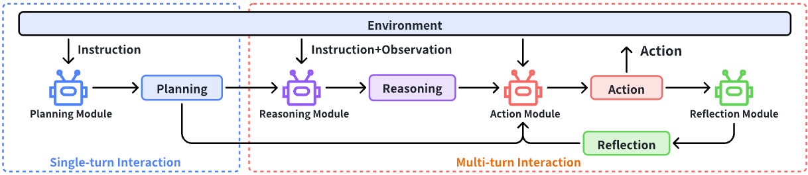

# CapaBench: Who's the MVP? A Game-Theoretic Evaluation Benchmark for Modular Attribution in LLM Agents

<div align="center">



🌐 [Website](https://zoe-yyx.github.io/CapaBench/) | 📃 [Paper](https://arxiv.org/abs/2502.00510) 
<!-- | 🤗 [Dataset](https://huggingface.co/datasets/OpenDFM/MULTI-Benchmark) | -->
<!-- 🏆 [Leaderboard](https://opendfm.github.io/MULTI-Benchmark/#leaderboard) | 📮 [Submit](https://opendfm.github.io/MULTI-Benchmark/static/pages/submit.html) -->

[简体中文](./README_zh.md) | English

</div>

## 🔥 News

- **[2025.2.19]** We have released the [GitHub Page](https://zoe-yyx.github.io/CapaBench/).

## 📖 Overview

Modular architectures in Large Language Model (LLM) agents integrate components like planning, reasoning, and reflection, yet quantifying their individual contributions remains challenging. We introduce **CapaBench**, a Shapley Value-based evaluation framework that systematically measures capability modules' marginal impacts. With 1,000+ multi-domain task scenarios, CapaBench enables combinatorial analysis through module substitution and interaction testing.


## 📊 Data

Some part of **CapaBench** is open-source, we also release the fully evaluated results of the models in the paper.

The other part of **CapaBench** is not open-source, for each benchmark, we provide 5 problems and 1 traj per problem as examples.

<!-- TODO: yyx, 数据占用空间可能过大, 可能不能全量上传到 github, 可能需要后续进行下载 -->

<!-- 
## ⏬ Download

You can simply download data using the following command:

```shell
cd eval
python download_data.py
```

The structure of `./data` should be something like:

```
./data
├── images                                       # folder containing images
├── problem_v1.3.1_20241210_release.json         # MULTI
├── knowledge_v1.2.2_20240212_release.json       # MULTI-Extend
├── hard_list_v1.3.0_20241203.json               # MULTI-Elite
├── captions_v1.3.1_20241210_blip.csv            # image captions generated by BLIP-6.7B
├── captions_v1.3.1_20241210_points.csv          # image captions generated by POINTS-1-5
├── ocr_v1.3.1_20241210_easyocr.csv              # OCR data generated by EasyOCR
└── ocr_v1.3.1_20241210_points.csv               # OCR data generated by POINTS-1-5
``` -->

## 📝 How to Evaluate

<!-- TODO(yyx): Add the description of the open-source benchmark -->

Some part of **CapaBench** is open-source, they're coming soon!
<!-- 
### Environment Preparation Before Usage

Each evaluator requires its unique environment setting, and a universal environment may not work for all evaluators. **Just follow the official guide.** If the corresponding model runs well, then so
should it fit in our framework.

You just need to install another two packages to run the evaluation code:

```shell
pip install tiktoken tqdm
```

If you just want to generate data for a specific setting (using `--debug` argument), this line above is all you need.

### Running Evaluation

For a quick start, see these examples:

Test GPT-4o model on whole MULTI with multimodal input, using MULTI-Extend as external knowledge:

```shell
python eval.py \
  --problem_file ../data/problem_{version}.json \
  --knowledge_file ../data/knowledge_{version}.json \
  --questions_type 0,1,2,3 \
  --image_type 0,1,2 \
  --input_type 2 \
  --model gpt-4o \
  --model_version gpt-4o-latest \
  --api_key sk-************************************************
```

Test Qwen-VL model on MULTI-Elite with image caption input, skip all questions not containing images, evaluate only multiple-choice questions, automatically set cuda device:

```shell
python eval.py \
  --problem_file ../data/problem_{version}.json \
  --subset ../data/hard_list_{version}.json \
  --caption_file ../data/captions_{version}.csv \
  --questions_type 0,1 \
  --image_type 1,2 \
  --input_type 1 \
  --model qwen-vl \
  --model_dir ../models/Qwen-VL-Chat
```

The evaluation script will generate a folder named `results` under the root directory, and the result will be saved in `../results/EXPERIMENT_NAME`. During the evaluation, the script will save
checkpoints in `../results/EXPERIMENT_NAME/checkpoints`, you can delete them after the evaluation is done. If the evaluation is interrupted, you can continue from the last checkpoint:

```shell
python eval.py \
  --checkpoint_dir ../results/EXPERIMENT_NAME
```

Most of the arguments are saved in `../results/EXPERIMENT_NAME/args.json`, so you can continue the evaluation without specifying all the arguments again. Please note that `--api_key` is not saved in
`args.json` for security reasons, so you need to specify it again.

```shell
python eval.py \
  --checkpoint_dir ../results/EXPERIMENT_NAME \
  --api_key sk-************************************************
```

For more details of arguments, please use `python eval.py -h`, and refer to `args.py` and `eval.py`.

### Add Support for Your Models

It's recommended to read the code of the other given evaluators in `eval/models` before your implementation.

Create `class YourModelEvaluator` and implement `generate_answer(self, question:dict)` to match the design supported in `eval.py` and `eval.sh`, which is anticipated to largely ease the coding
process.

**Do not forget to add their references into `args.py` for the convenience of usage.**

You can execute `model_tester.py` in the `eval` folder to check the correctness of you implementation. Various problems including implementation errors, small bugs in code, and even wrong environment
settings may cause failure of the evaluation. The examples provided in the file cover most kinds of cases presented in our benchmark. Feel free to change the code in it to debug your code😊

```shell
python model_tester.py <args> # args are similar to the default settings above
```

### Create Captions and OCR Data for Images

Generate captions or OCR data for images, and save them in csv with format below:

```
../data/images/czls/502_1.png,a cartoon drawing of a man standing in front of a large block
../data/images/czls/525_1.png,a chinese newspaper with the headline, china's new year
...
```

We provide two example scripts to generate captions (`image_caption.py`) and OCR data  (`image_ocr.py`) for images.

## 📮 How to Submit

You need to first prepare a UTF-8 encoded JSON file with the following format:

```
{
    "czsx_0_0": {
        "question_id": "czsx_0_0",
        "question_image_number": 1,
        "image_list": [...],            # optional
        "input_message": ...,           # optional
        "prediction": "C"
    },
    ...
}
```

If you evaluate the model with our official code, you can simply zip the prediction file `prediction.json` and the configuration file `args.json` in the experiment results folder
`. /results/EXPERIMENT_NAME` in `.zip` format.

Then, you can submit your result to our [evaluation page](https://opendfm.github.io/MULTI-Benchmark/static/pages/submit.html).

You are also welcomed to pull a request and contribute your code to our evaluation code. We will be very grateful for your contribution!

**[Notice]** Thank you for being so interested in the **MULTI** dataset! If you want to add your model in our leaderboard, please fill in [this questionnaire](https://wj.sjtu.edu.cn/q/89UmRAJn), your
information will be kept strictly confidential, so please feel free to fill it out. 🤗 -->

## 📑 Citation

If you find our work useful, please cite us!

```
@misc{yang2025whosmvpgametheoreticevaluation,
      title={Who's the MVP? A Game-Theoretic Evaluation Benchmark for Modular Attribution in LLM Agents}, 
      author={Yingxuan Yang and Bo Huang and Siyuan Qi and Chao Feng and Haoyi Hu and Yuxuan Zhu and Jinbo Hu and Haoran Zhao and Ziyi He and Xiao Liu and Zongyu Wang and Lin Qiu and Xuezhi Cao and Xunliang Cai and Yong Yu and Weinan Zhang},
      year={2025},
      eprint={2502.00510},
      archivePrefix={arXiv},
      primaryClass={cs.AI},
      url={https://arxiv.org/abs/2502.00510}, 
}
```

## 📧 Contact Us

If you have any questions, please feel free to contact us via email `zoeyyx@sjtu.edu.cn` and `wnzhang@sjtu.edu.cn`