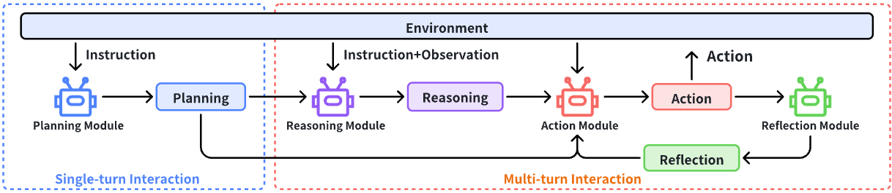

# CapaBench: Who's the MVP? A Game-Theoretic Evaluation Benchmark for Modular Attribution in LLM Agents

<div align="center">



🌐 [项目主页](https://zoe-yyx.github.io/CapaBench/) | 📃 [论文](https://arxiv.org/abs/2502.00510) 
<!-- | 🤗 [数据集](https://huggingface.co/datasets/OpenDFM/MULTI-Benchmark) | -->
<!-- 🏆 [排行榜](https://opendfm.github.io/MULTI-Benchmark/#leaderboard) | 📮 [提交结果](https://opendfm.github.io/MULTI-Benchmark/static/pages/submit.html) -->

[简体中文](./README_zh.md) | [English](./README.md)

</div>

## 🔥 最新动态

- **[2025.2.19]** 我们已发布[GitHub Page](https://zoe-yyx.github.io/CapaBench/)。

## 📖 项目概述

大型语言模型（LLM）智能体通常采用包含规划、推理和执行等模块的架构，但量化各模块对系统性能的贡献仍具挑战性。我们提出**CapaBench**——基于Shapley值的评估框架，通过模块替换和组合测试系统性度量各能力模块的边际贡献。该框架包含1,000+跨领域任务场景，支持通过组合分析揭示模块间的协同效应。

## 📊 评测数据

**CapaBench**部分 Benchmark 完全开源，我们也发布了论文中模型的完整评测轨迹。

**CapaBench**部分 Benchmark 保持闭源, 对于每个Benchmark，我们提供5个问题, 每个问题提供1个评测轨迹作为示例。

<!-- TODO: yyx, 数据占用空间可能过大, 可能不能全量上传到 github, 可能需要后续进行下载 -->

<!-- 
## ⏬ 数据下载

通过以下命令下载数据：

```shell
cd eval
python download_data.py
```

数据目录结构如下：

./data
├── images                                       # 图片文件夹
├── problem_v1.3.1_20241210_release.json         # 基准测试集
├── knowledge_v1.2.2_20240212_release.json       # 扩展知识库
├── hard_list_v1.3.0_20241203.json               # 困难样例集
├── captions_v1.3.1_20241210_blip.csv            # BLIP-6.7B生成的图片描述
├── captions_v1.3.1_20241210_points.csv          # POINTS-1-5生成的图片描述
├── ocr_v1.3.1_20241210_easyocr.csv              # EasyOCR提取的OCR数据
└── ocr_v1.3.1_20241210_points.csv               # POINTS-1-5提取的OCR数据
-->

## 📝 评估指南

<!-- TODO(yyx): 补充开源基准说明 -->

**CapaBench**部分 benchmark 即将开源，敬请期待！

<!-- 
### 环境配置

各评估器需要独立环境配置，建议遵循官方指南。基础依赖安装：

```shell
pip install tiktoken tqdm
```

### 运行评估

快速开始示例：

使用GPT-4o评估完整测试集：

```shell
python eval.py \
  --problem_file ../data/problem_{version}.json \
  --knowledge_file ../data/knowledge_{version}.json \
  --questions_type 0,1,2,3 \
  --image_type 0,1,2 \
  --input_type 2 \
  --model gpt-4o \
  --api_key sk-************************************************
```

评估Qwen-VL在困难集上的表现：

```shell
python eval.py \
  --problem_file ../data/problem_{version}.json \
  --subset ../data/hard_list_{version}.json \
  --caption_file ../data/captions_{version}.csv \
  --questions_type 0,1 \
  --image_type 1,2 \
  --input_type 1 \
  --model qwen-vl \
  --model_dir ../models/Qwen-VL-Chat
```

评估结果将保存在`../results/EXPERIMENT_NAME`。支持断点续评：

```shell
python eval.py \
  --checkpoint_dir ../results/EXPERIMENT_NAME \
  --api_key sk-************************************************
```

### 模型适配指南

参考`eval/models`实现`YourModelEvaluator`类，需实现`generate_answer`方法。通过测试脚本验证实现：

```shell
python model_tester.py <参数>
```

### 生成图片描述与OCR数据

使用示例脚本生成元数据：

```shell
python image_caption.py  # 生成图片描述
python image_ocr.py      # 生成OCR数据
```

## 📮 结果提交

准备UTF-8编码的预测文件：

```json
{
    "czsx_0_0": {
        "question_id": "czsx_0_0",
        "prediction": "C"
    },
    ...
}
```

打包预测文件与配置文件后，通过[提交页面](https://opendfm.github.io/MULTI-Benchmark/static/pages/submit.html)提交。欢迎通过PR贡献代码！

**[注意]** 提交排行榜需填写[问卷](https://wj.sjtu.edu.cn/q/89UmRAJn)，信息严格保密。 -->

## 📑 引用声明

如果您觉得我们的工作有帮助，请引用我们的论文：

```
@misc{yang2025whosmvpgametheoreticevaluation,
      title={Who's the MVP? A Game-Theoretic Evaluation Benchmark for Modular Attribution in LLM Agents}, 
      author={Yingxuan Yang and Bo Huang and Siyuan Qi and Chao Feng and Haoyi Hu and Yuxuan Zhu and Jinbo Hu and Haoran Zhao and Ziyi He and Xiao Liu and Zongyu Wang and Lin Qiu and Xuezhi Cao and Xunliang Cai and Yong Yu and Weinan Zhang},
      year={2025},
      eprint={2502.00510},
      archivePrefix={arXiv},
      primaryClass={cs.AI},
      url={https://arxiv.org/abs/2502.00510}, 
}
```

## 📧 联系我们

如有任何疑问，请通过邮件联系：`zoeyyx@sjtu.edu.cn` 和 `wnzhang@sjtu.edu.cn`
